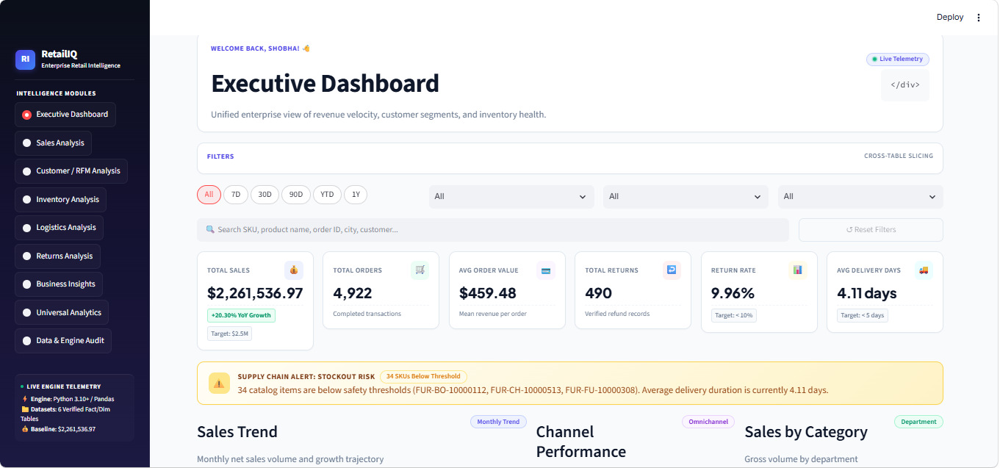
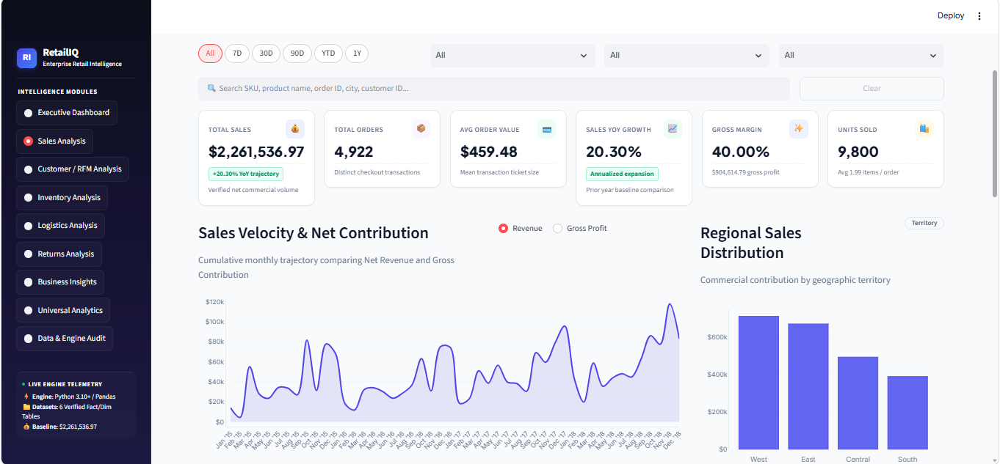
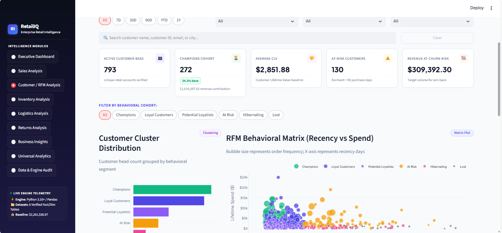
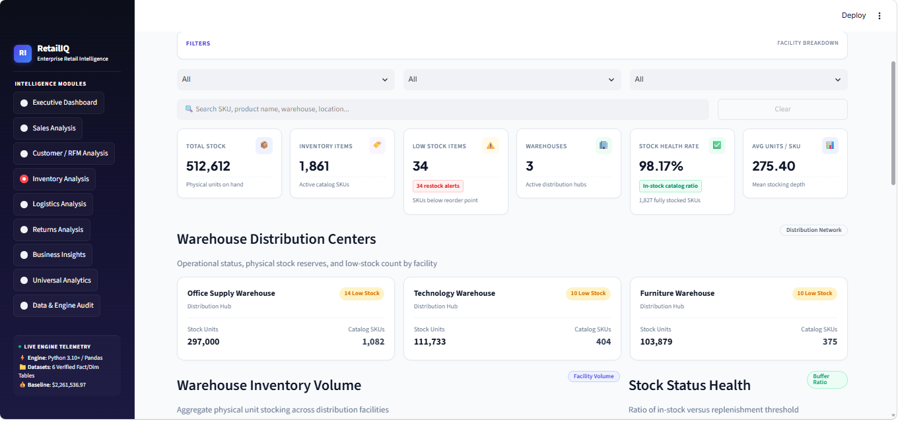
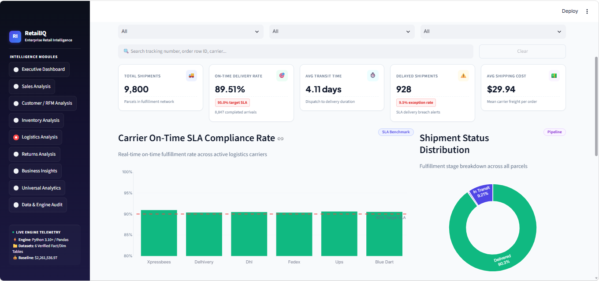
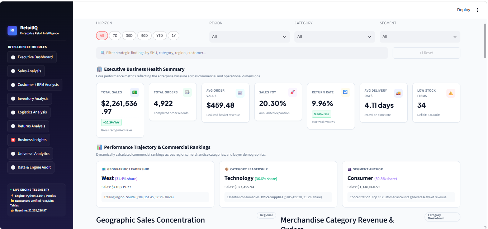

# 🛍️ RetailIQ — Enterprise Retail Intelligence Platform

<p align="center">

### Turn Retail Data into Intelligent Decisions

An end-to-end retail analytics and business intelligence platform built with Python and Streamlit to transform raw retail data into actionable insights across sales, customers, inventory, logistics, returns, and business performance.

</p>

<p align="center">

[](https://www.python.org/)
[](https://streamlit.io/)
[](https://pandas.pydata.org/)
[](https://numpy.org/)
[](https://plotly.com/)
[](https://pytest.org/)
[](LICENSE)

</p>

---

## 🌐 Live Demo

### 🚀 RetailIQ — Live Application

**Live App:**  
https://retailiq-jfycwjsr3ssm8dx3cyraz9.streamlit.app/

**GitHub Repository:**  
https://github.com/shobha-bit/RetailIQ

---

# 📊 Project at a Glance

| Metric | Value |
|---|---:|
| 💰 Total Sales | **$2,261,536.97** |
| 🧾 Distinct Orders | **4,922** |
| 👥 Customers | **793** |
| 🛒 Average Order Value | **$459.48** |
| 📦 Products / SKUs | **1,861** |
| ↩️ Total Returns | **490** |
| 📉 Return Rate | **9.96%** |
| 🚚 Shipments | **9,800** |
| 🎯 On-Time Delivery | **89.51%** |
| 📦 Inventory Stock | **512,612 units** |
| ⚠️ Low-Stock SKUs | **34** |
| 📈 Sales YoY Growth | **20.30%** |
| 🧪 Automated Tests | **121 Passed** |

---

# 📸 Dashboard Preview

## 🏠 Executive Dashboard

The Executive Dashboard provides a unified enterprise view of revenue performance, customer segments, inventory health, sales trends, channel performance, category contribution, regional performance, top products, and operational alerts.

<p align="center">

</p>

---

## 💰 Sales Analytics

The Sales Analytics dashboard focuses on revenue performance, order volume, average order value, year-over-year growth, gross margin, units sold, regional sales distribution, and sales velocity.

<p align="center">

</p>

---

## 👥 Customer & RFM Analytics

The Customer Analytics module applies RFM-based behavioral segmentation to understand customer value, purchasing behavior, and retention risk.

<p align="center">

</p>

---

## 📦 Inventory Analytics

The Inventory Analytics dashboard provides visibility into stock levels, SKU availability, low-stock items, warehouse distribution, and overall stock health.

<p align="center">

</p>

---

## 🚚 Logistics Analytics

The Logistics Analytics dashboard monitors shipment volume, carrier performance, on-time delivery, delayed shipments, transit time, shipping cost, and SLA compliance.

<p align="center">

</p>

---

## 💡 Business Insights

The Business Insights module converts analytical results into decision-oriented insights across geography, merchandise categories, customer segments, and operational performance.

<p align="center">

</p>

---

# 📌 About RetailIQ

**RetailIQ** is an enterprise-style retail intelligence platform designed to help businesses transform operational data into actionable business intelligence.

The platform brings together multiple retail data domains into a single analytical environment:

- Sales
- Customers
- Products
- Inventory
- Transportation
- Returns

Instead of relying on disconnected spreadsheets or static reports, RetailIQ provides interactive dashboards, analytical KPIs, customer segmentation, operational monitoring, business insights, and reusable dataset exploration.

---

# 🎯 Business Problem

Retail organizations generate large volumes of data across different business functions. However, raw transactional data does not automatically provide meaningful decision support.

RetailIQ addresses this gap by providing a centralized platform for answering questions such as:

### 💰 Sales

- How much revenue is being generated?
- Which categories and products drive sales?
- How is revenue changing over time?
- Which regions contribute the most revenue?
- What is the average order value?

### 👥 Customers

- Who are the highest-value customers?
- Which customers are loyal?
- Which customers are at risk?
- What is the potential revenue exposure from at-risk customers?

### 📦 Inventory

- Which SKUs have low stock?
- How much inventory is available?
- How is stock distributed across warehouses?
- Which products require replenishment attention?

### 🚚 Logistics

- How many shipments are being processed?
- What percentage of shipments are delivered on time?
- Which shipments are delayed?
- How are carriers performing against SLA targets?

### ↩️ Returns

- What is the return rate?
- Which return reasons occur most frequently?
- Which products are affected by returns?
- What is the total refund liability?

### 💡 Business Strategy

- Where is revenue concentrated?
- Which customer segments need retention attention?
- Where are operational risks increasing?
- Which business areas require further investigation?

---

# ✨ Key Features

## 1️⃣ Executive Dashboard

Provides an enterprise-level overview of:

- Total Sales
- Total Orders
- Average Order Value
- Total Returns
- Return Rate
- Average Delivery Days
- Sales Trends
- Channel Performance
- Category Performance
- Regional Sales
- Top Performing Products
- Business Alerts
- Operational Health

---

# 2️⃣ Sales Analytics

The Sales Analytics module provides detailed revenue intelligence.

### Key Metrics

- Total Sales: **$2,261,536.97**
- Total Orders: **4,922**
- Average Order Value: **$459.48**
- Sales YoY Growth: **20.30%**
- Gross Margin: **40.00%**

### Analysis Areas

- Revenue trends
- Sales velocity
- Order volume
- Product performance
- Category performance
- Regional sales
- Customer segment contribution
- Gross profit
- Units sold
- Year-over-year growth

---

# 3️⃣ Customer & RFM Analytics

RetailIQ uses **RFM — Recency, Frequency and Monetary Value** analysis to segment customers based on purchasing behavior.

## Customer Segments

| Segment | Customers |
|---|---:|
| 🏆 Champions | **272** |
| 💙 Loyal Customers | **247** |
| 🌱 Potential Loyalists | **123** |
| ⚠️ At Risk | **87** |
| 💤 Hibernating | **43** |
| ❌ Lost | **21** |

### Customer Intelligence

The platform helps identify:

- High-value customers
- Loyal customers
- Potential loyalists
- At-risk customers
- Dormant customers
- Lost customers
- Customer revenue exposure
- Retention opportunities

### Retention Risk

The combined **At Risk + Hibernating** population contains:

**130 customer accounts**

with approximately:

**$309,392.30 revenue exposure**

This provides a useful basis for customer retention and win-back strategies.

---

# 4️⃣ Inventory Analytics

RetailIQ provides operational visibility into product stock and warehouse inventory.

## Key Metrics

| Metric | Value |
|---|---:|
| Total Stock | **512,612 units** |
| Inventory Items | **1,861** |
| Low Stock Items | **34** |
| Warehouses | **3** |
| Stock Health Rate | **98.17%** |
| Average Units / SKU | **275.40** |

### Inventory Analysis Includes

- Warehouse distribution
- Inventory volume
- Stock health
- Low-stock monitoring
- SKU-level inventory
- Warehouse-level stock
- Replenishment risk
- Stock distribution

---

# 5️⃣ Logistics Analytics

The Logistics module provides supply-chain and fulfillment intelligence.

## Key Metrics

| Metric | Value |
|---|---:|
| Total Shipments | **9,800** |
| On-Time Delivery Rate | **89.51%** |
| Average Transit Time | **4.11 days** |
| Delayed Shipments | **928** |
| Average Shipping Cost | **$29.94** |

### Carrier Coverage

RetailIQ analyzes performance across six carriers:

- Blue Dart
- Delhivery
- DHL
- FedEx
- UPS
- Xpressbees

### Logistics Analysis Includes

- Carrier SLA compliance
- On-time delivery
- Delayed shipments
- Shipment status
- Transit time
- Freight cost
- Fulfillment velocity
- Carrier comparison
- Operational exceptions

---

# 6️⃣ Returns Analytics

The Returns module provides visibility into product return behavior and financial exposure.

## Key Metrics

| Metric | Value |
|---|---:|
| Total Returns | **490** |
| Distinct Returned Orders | **465** |
| Returned SKUs | **424** |
| Return Rate | **9.96%** |
| Refund Liability | **$81,807.14** |
| Average Refund / Return | **$166.95** |

### Returns Analysis Includes

- Return volume
- Return rate
- Returned orders
- Returned SKUs
- Return reasons
- Refund liability
- Average refund value
- Root-cause analysis
- Return-related business exposure

---

# 7️⃣ Business Insights

The Business Insights module transforms analytical outputs into business-oriented findings.

### Example Business Findings

#### 🌎 Geographic Leadership

The **West** region is the leading revenue territory with approximately:

**$710K+ in sales**

---

#### 💻 Category Leadership

**Technology** contributes approximately:

**$827,455.94 in sales**

---

#### 👥 Customer Segment Leadership

The **Consumer** segment contributes approximately:

**$1,148,060.51 in sales**

---

#### 📈 Sales Growth

The platform identifies approximately:

**20.30% year-over-year sales growth**

between the available comparison periods.

---

# 8️⃣ Universal Analytics Engine

One of the major capabilities of RetailIQ is the **Universal Analytics Engine**.

It allows users to explore new tabular datasets through a reusable analytical workflow rather than restricting the platform to predefined retail dashboards.

## Universal Analytics Workflow

```text
Upload Dataset
      ↓
Dataset Loading
      ↓
Data Profiling
      ↓
Data Type Detection
      ↓
Data Cleaning
      ↓
Statistical Analysis
      ↓
Exploratory Analysis
      ↓
Dynamic Visualization
      ↓
Business Insights
---

## 🔍 Universal Analytics Capabilities

The Universal Analytics Engine provides a reusable workflow for exploring additional tabular datasets.

### Key Capabilities

- 📂 CSV dataset upload
- 🔎 Automatic dataset profiling
- 🧠 Data type detection
- 🧹 Data cleaning
- 📊 Statistical analysis
- 📈 Exploratory data analysis
- 📉 Dynamic visualizations
- 🔗 Correlation analysis
- 📅 Time-series analysis
- 💡 Business insight generation

---

# 🧠 Data Analytics Pipeline

RetailIQ follows a structured end-to-end data-to-insight workflow:

```text
Raw Retail Data
       ↓
Data Loading
       ↓
Data Validation
       ↓
Data Cleaning
       ↓
Data Transformation
       ↓
Analytics Engine
       ↓
Business Calculations
       ↓
Interactive Dashboards
       ↓
Business Insights

RetailIQ/
│
├── python_app/
│   ├── analytics/
│   │   ├── business_insights.py
│   │   ├── retail_analytics.py
│   │   ├── validation.py
│   │   └── test_*.py
│   │
│   ├── dashboards/
│   │   ├── executive_dashboard.py
│   │   ├── sales_analysis.py
│   │   ├── customer_analysis.py
│   │   ├── inventory_analysis.py
│   │   ├── logistics_analysis.py
│   │   ├── returns_analysis.py
│   │   ├── business_insights.py
│   │   └── universal_analytics.py
│   │
│   ├── data/
│   │   └── loader.py
│   │
│   ├── universal/
│   │   ├── analyzer.py
│   │   ├── cleaner.py
│   │   ├── loader.py
│   │   ├── profiler.py
│   │   └── type_detector.py
│   │
│   ├── utils/
│   │   ├── formatting.py
│   │   └── ui.py
│   │
│   ├── app.py
│   └── config.py
│
├── public/
│   └── data/
│
├── screenshots/
│   ├── executive-dashboard.png
│   ├── sales-analytics.png
│   ├── customer-rfm.png
│   ├── inventory-analytics.png
│   ├── logistics-analytics.png
│   └── business-insights.png
│
├── src/
│   └── React + TypeScript reference application
│
├── requirements.txt
├── README.md
├── LICENSE
└── .gitignore